# Design Document

By J. Brodie Day

Video overview: <https://youtu.be/-WM4uEf5CAQ>

## Scope

* What is the purpose of your database?

The purpose of this database is to store game-specific and user-provided information about custom characters in the Daggerheart role playing game. [Daggerheart](https://www.daggerheart.com/) website for reference. The Standard Reference Document of the Daggerheart gaming system is free to use & develop under the Open Gaming License.
The database is designed for a hypothetical program where a Daggerheart player could select game-specific options (like a character class, subclass, ancestry, armor, etc), and enter their own custom info (character name, etc), and generate a character sheet with the pertinent information from the game's rule system.

For example, a user wishing to create a Daggerheart character might select *Sorcerer* as their class in the hypothetical UI -- we would be able to use this database to fetch
class features, applicable subclass options, equipment, etc from our tables to serve that info to the UI. Once finished selecting all of their options, the user would be able to save their character to the database (and hypothetically generate a character sheet to play Daggerheart with).

* Which people, places, things, etc. are you including in the scope of your database?

The database will include tables for storing game-specific information (ie. features and statistics of classes, subclasses, and equipment that are provided by the game system), as well as tables for storing user-generated data (users and the characters they create).

Role playing game systems are vast, complex, and contain many dozens of subclasses, optional class features, and equipment loadouts to choose from. Consequently, I've decided to only include game features that are included in the Daggerheart Quickstart Adventure guide intended for begginner players. This includes a limited subset of classes, ancestries, and equipment for level 1 characters.

* Which people, places, things, etc. are *outside* the scope of your database?

All game features that are not included in the Quick Start Adventure document. For simplicity, this database assumes each character will only wear one armor and use one weapon. There's no reason the design couldn't handle charcters beyond level 1, but for simplicity it will currently contain game-provided class/subclass data for level 1 characters.

## Functional Requirements

**Requires MySQL V8**

* What should a user be able to do with your database?

    - Reference game-specific information related to creating Daggerheart characters from the Quickstart Adventure Guide
    - Create a user profile
    - View all characters that belong to a given user
    - Create, update & delete (or archive without permanently deleting) Daggerheart characters
    - Update a character's status (hit points, hope, stress and, other statistics) to reflect in-game changes

* What's beyond the scope of what a user should be able to do with your database?
    - Character classes, features, and equipment not included in the starter guide
    - Inventorying custom equipment, or equipment beyond one armor and one weapon per character
    - Class/subclass features beyond level 1

## Representation

### Entities

* Which entities will you choose to represent in your database?
    - Users
    - Characters
    - Users+Characters junction
    - Classes
    - Subclasses
    - Ancestries
    - Communities
    - Weapons
    - Armor
    - Character status

* What attributes will those entities have?

    **Users**:

    - In production this would also store password hashes and other user data, but here it will simply contain email and id columns.

    **Characters**:

    - This table contains an id column, and a column relating to the primary key of each of the armors, weapons, ancestries, communities, domains, classes, subclasses, and character_status tables.

    **Users+Characters junction**:

    - This table relates the users and characters tables on their respective primary keys.

    **Character Status**:

    - This table contains columns representing dynamic game-specific data (current/max hit points, level, hope, fear, stress).

    **The remaining tables** (**armors, weapons, ancestries, communities, domains, classes, and subclasses**):

    - These contain game-provided data. This is where stats and features of each of these entities (as specified by the game rules) will be stored. This data will be created by the program to reference as a user makes choices when creating a new character or when updating their character sheet with different equipment or features.

* Why did you choose the types you did?

    - `TINYINT` was chosen as a data type for the numeric ID in all tables in which there is a small and finite number of options (ie.
    there are fewer than 10 classes in the game, so the classes table does not need an ID larger than TINYINT). `TINYINT` was also used where a numeric value would never exceed 127 per the game rules (ie. character level).

    - `BIGINT` was chosen for the numeric ID in the `users` and `characters` tables since there could theoretically be many users, and more than one character per user.

    - `VARCHAR` was used for many text entries - this is due to potential large variance in text lengths (for example, subclass foundation feature copy). Varchar allows for less storage waste where there are large variances in char length across rows. This decision was also made for entries like feature names, email addresses (users.username) and character names for the same reason, though the potential for waste there is less due to the smaller char lengths. Varchar would be less critical for entries like usernames and passwords that have a fixed max length, but could still be considered.

    - `ENUM` was used for entries where there are only a few possible predetermined valid options that aren't likely to change or expand. For example, the six core ability traits will always be those same six text values.
    ** It might be necessary to rethink ENUM in future for things like armor and weapon names because support custom or magic items may be needed.

    - `BOOLEAN` was used for the `character_status`(`is_alive`) entry because it can only ever have one of two values.

    * Why did you choose the constraints you did?
    - `NOT NULL` was used anywhere the game rules, hypothetical server logic, or hypothetical UI would absolutely require that value.

    - `UNIQUE` was chosen for weapon and armor names to avoid adding duplicates when additional characters are created using the same equipment. It was also chosen for username/email (since that would be used for authentication purposes and needs to be unique).

    - `CHECK` was used to constrain data values where game rules specify a range of possible values (for ex. a player may only have 0-6 'Hope' at a time).

    - A `DEFAULT` value of 1 was chosen for character level in the `character_status` table to simplify creating a new character.

    - A `DEFAULT` value of 0 was chosen for the stress, hope, and fear values in `character_status` since all new characters begin with those values.

    - All primary `id` columns use `AUTO_INCREMENT` to generate an incremented numeric ID for each new row.

### Relationships

 Note: This diagram does not contain all attributes - only those with relational significance to other entities.

**`users`**:

- Simply stores a username and id for simplicity.

**`user_char_ids`**:

- Relates the `users` (one to zero or many) table and the `characters` (one to one) table by their respective id values. This mainly exists to help find a given user's character in the `characters` table (a user may have multiple characters, and separate users may have characters with identical names, so character name is insufficient for locating a specific character). Since the id columns are indexed, we can quickly locate all entries in the `characters` table that belong to a given user.

**`characters`**:

- Relates to each other table below. A row in this table will contain all data the program would require to fetch any information about a user's character from game-supplied data or the character's status. This table contains both user-supplied data (ie. the character's name) and will reference game-supplied data through its relationship to the other tables in the database (ie. the properties of a specific armor worn by a character).

**`classes`**:

- Contains game-supplied data about a character's chosen vocation (ie. sorcerer or bard). Referenced by the `characters` table with a one to zero or many relationship via the `class_id` column.

**`subclasses`**:

- Contains the game-supplied variants of each vocation, or "class" in the game rules. This table references the `classes` table to link individual subclasses with their corresponding classes. Referenced by the `characters` table this data with a one to zero or many relationship via the `subclass_id` column.

**`character_status`**:

- Contains the real-time status of a given character (ie. hit points). This table will reference the `characters` table with a one to one relationship via the `character_id` column.

**`communities`** and **`ancestries`**:

- Contain game-supplied data about a character's heritage (ie. their genetic ancestry, and the culture they grew up in). Referenced by the `characters` table with a one to zero or many relationship via the `community_id` and `ancestry_id` columns.

**`armors`** and **`weapons`**:

- Contain game-supplied data about possible equipment a character may be using. Referenced by the `characters` table with a one to zero or many relationship via the `armor_id` and `weapon_id` columns.

## Optimizations

* Which optimizations (e.g., indexes, views) did you create? Why?

    The `characters` table may get quite large - it stores a fair bit of information per row, and given many users (and likely multiple characters per user), it could be quite slow scanning that table for unsorted values like `name` to fetch a user's characters every time a user logs in, or accesses a different character. For this reason, an index of character names was added - speeding up searching for character by name. The `user_char_ids` table was also added to relate users to characters which will likely be useful in filtering characters by the user's id.

    -- maybe we want to create a view of the given class/subclass/ancestry/culture/weapon/armor when a character is accessed in the `characters` table - so we don't run into performance issues if we need to fetch that data repeatedly.

    I considered creating a view of a given user's character ids - but since this is something we would want to do for a given user (we only want to find a specific user's characters, which we don't know until a user logs in). So instead, opted for a stored procedure that can be called by the server when a user logs in - this way we can pass that user's ID as a parameter to the stored procedure.

    I also considered creating a view of a given character's traits (as a complete picture of a character - with the full text of all of its features, instead of just references to ids in the game rules tables). This could be used in packaging a single result to pass to a server for a user to make use of. However, for the same reason as above (we need to know the ID of the specific character we're looking for), opted instead to create a stored procedure so we can pass the ID as a parameter.

    For both cases, if we were running a server, it would be easy to simply tell the server to run the `CREATE TEMPORARY VIEW` command when a user logs in, or selects a character from their list. But without server logic, this seems like the best solution for finding specific instances in this case.

    Some triggers were added to handle updating the `user_char_ids` junction table and `character_status` table whenever a new character is inserted or deleted.

## Limitations

* What are the limitations of your design?

    Currently the design does not support custom equipment (or any equipment not included in the Daggerheart starter guide), using multiple pieces of equipment, multiclassing, or adding class features beyond level 1. This is mainly to simplify the implementation to not include parts of the game-provided text that we don't need to demonstrate the database - but would be required features in a real application. There is also no capabilities for an extended inventory - logging items that a character may aquire that are not armor or weapons (ie. healing potions).

* What might your database not be able to represent very well?

    As-is, the database is focused on the capabilities required to create a character at level 1 for printing or use as a virtual character sheet. In order to support more robust gameplay and use beyond level 1, we would need to update the inventory design to support more types of inventory, nad update the class/subclass tables to support features beyond the foundation feature.

    Currently, there is no way to prevent a user from creating multiple characters with the same name. We don't want a unique constraint on character name because different users may wish to use the same character name. At the very least, multiple characters with the same name belonging to the same user would be confusing in a hypothetical UI. A hypothetical server could solve this by not allowing a duplicate name to be submitted by a given user.
